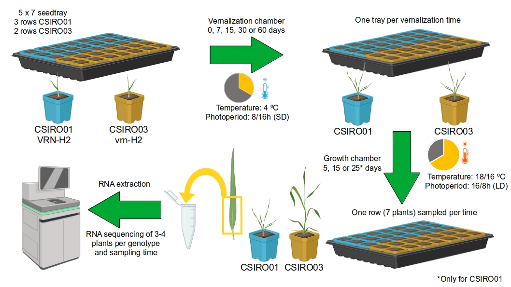

## Summary

This is a repository related to a multifactorial time-series RNA-Seq experiment comparing two Near-Isogenic Lines of barley, differing in the presence/absence of the vernalization gene *HvVRN2*. Data, workflow and scripts are detailed.

This research is part of my PhD thesis and was mostly carried out in [GDMV](http://sitios.csic.es/web/eead-estacion-experimental-aula-dei/departamentos/genetica/gdmv/index) and [Compbio](https://eead-csic-compbio.github.io/index.html) groups of the [Estación Experimental de Aula Dei](https://www.eead.csic.es/), Spain, and during a three-month stay at the [Borrill lab](https://borrilllab.com/) at the [John Innes Centre](https://www.jic.ac.uk/), UK.

Manuscript draft is under peer-review, and this repository will be updated during the process and its publication.

## Methodology and workflow

Most of the analyses were done in R. Briefly, the methodology could be divided in:

| Section | Name                                              | URL |
|---------|---------------------------------------------------|-----|
| 1       | Expression quantification                         | --  |
| 2       | Identification of differentially expressed genes  | --  |
| 3.1     | Clustering of co-expressed genes                  | --  |
| 3.2     | Gene Ontology enrichment of co-expression modules | --  |
| 4.1     | Transcription factor identification               | --  |
| 4.2     | Gene Regulatory Network analysis                  | --  |
| 5       | Modelling of protein complexes                    | --  |

&nbsp;

Plant material and experimental design are not described here, but the following figure summarises most of the experiment and growth conditions:

&nbsp;

Scripts were mostly written by me, Chesco Montardit-Tarda.
Co-expression clustering and gene regulatory network analysis were based on scripts fom Philippa Borrill, during my JIC stay.

